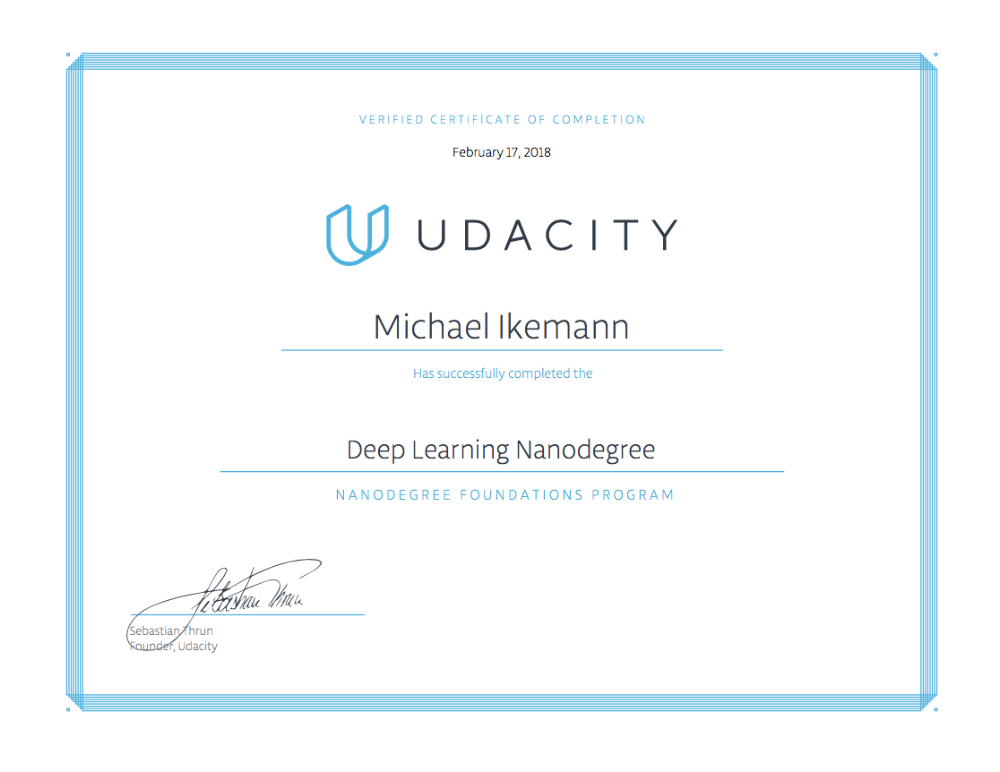
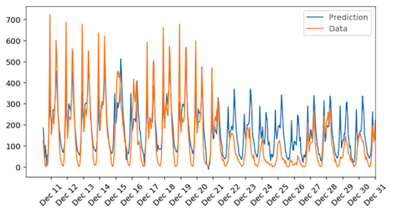
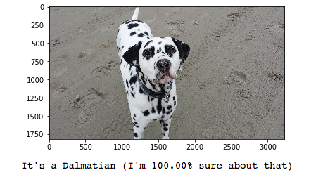
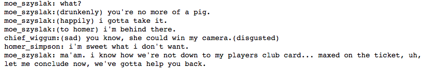
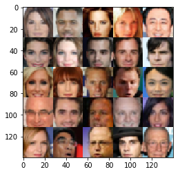
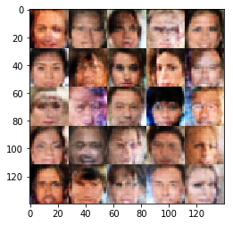

---

In this repository you can find my results of all projects and relevant exercises of the Udacity Deep Learning Foundation Nanodegree.

---

**Important note:**

If not noted otherwise the originals of all source and data files provided here are Copyright (C) Udacity.
For more details visit
- http://www.udacity.com
- https://github.com/udacity/deep-learning
- https://github.com/udacity/deep-learning/blob/master/LICENSE

Please use these files with respect to Udacity's honor code, to the copyright holders and do not claim them as your own.

You are of course welcome to learn from the files provided here and even more welcome to let me know if you are a student of the DLF Nanodegree as well and have improvement ideas for the tougher projects. :) 

Contact me on [LinkedIn](https://www.linkedin.com/in/michael-ikemann/)

---

## Chapters ##

The nanodegree was subdivided into the following chapters:

1. Introductions
2. Neural Networks
3. Convolutional Networks
4. Recurrent Networks
5. Generative Adversarial Networks
6. Deep Reinforcement Learning

---

## Projects ##

The following rated projects were part of this nanodegree:

1. **Revenue prediciton using Deep Learning - Predicting Bike Sharing Data**
    - 
    - [Source](http://alyxion.github.io/Udacity_DeepLearningFoundationsNd/2_1_Project_1_FirstNeuralNetwork/Your_first_neural_network.html)
2. **Convolutional Neural Network for object classification - Dog Breed Classifier**
    - 
    - [Source](https://alyxion.github.io/Udacity_DeepLearningFoundationsNd/3_3_Project_2_Dog_Breed_Classifier/dog_app.html)
3. **Recurrent Neural Network - Generating a TV Script**
    - 
    - [Source](http://alyxion.github.io/Udacity_DeepLearningFoundationsNd/4_7_Project_3_RNN_TV_Script/dlnd_tv_script_generation.html)
4. **Generative Adversarial Network - Generate generic faces using Deep Convolutional GANs**
    - **Original samples**: 
        - 
    - **Generated samples**:
        - 
    - [Source](https://alyxion.github.io/Udacity_DeepLearningFoundationsNd/5_3_Project_4_Face_Generation/dlnd_face_generation.html)
5. **Deep Reinforcement Learning - Teach a quadcopter how to fly**
    - 
    - [Source](6_12_Project_5_Capstone_Quadcopter/quad_controller_rl/)
